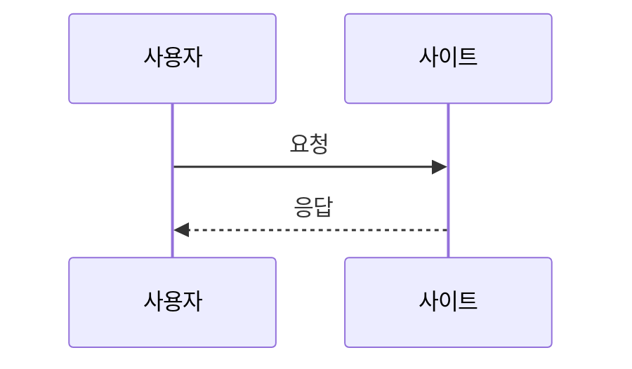

# 컴포넌트 가이드

이 문서는 글과 페이지에서 사용할 수 있는 표현 방식과 운영 원칙을 설명합니다. 사이트 공통 UI는 `_includes`와 `assets/css/main.css`에서 관리하며, 게시글마다 같은 HTML을 복사하지 않습니다.

## 제목과 본문

- 페이지 또는 게시글 제목 h1은 레이아웃이 출력합니다.
- Markdown 본문은 h2(`##`)부터 시작하고 하위 절은 h3, h4 순으로 씁니다.
- 링크 문구는 “여기”보다 목적지를 설명합니다.
- 긴 URL과 코드는 자체 영역에서만 가로 스크롤되도록 합니다.

## 버튼과 링크

일반 본문 이동은 링크를 사용합니다. dialog 열기, 복사, 북마크처럼 현재 화면에서 동작하는 기능은 `<button type="button">`을 사용합니다.

```html
<a class="button button-primary" href="/about/">About 보기</a>
<button class="button button-secondary" type="button">동작 실행</button>
```

- 아이콘만 있는 버튼에는 `aria-label`이 필요합니다.
- 버튼과 링크의 focus-visible 표시를 제거하지 않습니다.
- 새 창 외부 링크에는 `target="_blank" rel="noopener noreferrer"`를 함께 씁니다.

## 태그와 분류

태그는 `_posts` 또는 `_projects` front matter에서 관리하며 카드 include가 출력합니다. 태그를 장식용 버튼처럼 하드코딩하지 않습니다. 클릭 가능한 필터는 링크나 버튼으로, 단순 메타데이터는 텍스트 칩으로 구분합니다.

## 게시글 카드

`_includes/post-card.html`을 사용합니다. 카드 데이터는 다음 순서로 채웁니다.

- 제목: `title`
- 설명: `description`, 없으면 안전하게 정리한 excerpt
- 이미지: `cover`, 이전 문서는 `thumbnail` fallback
- 분류: `categories`, `tags`, `series`
- 날짜와 읽기 시간: front matter와 렌더 본문 기준

대표 이미지가 없을 때 빈 이미지 상자를 만들지 않습니다. 전체 카드를 과도한 그림자 박스로 만들기보다 목록의 얇은 구분선과 타이포그래피 위계를 유지합니다.

## 프로젝트 카드

`_includes/project-card.html`을 사용합니다. 게시글 카드와 달리 `status`, `period`, `role`, `technologies`를 먼저 파악할 수 있게 표시합니다. `repository_url`과 `demo_url`이 비어 있으면 버튼 전체를 숨깁니다. 확인되지 않은 성과나 수치를 카드에 추가하지 않습니다.

## Callout

Markdown에서 다음 형식을 사용합니다.

```markdown
> [!NOTE]
> 문맥을 보충하는 설명입니다.
```

지원 레이블:

| 레이블 | 용도 |
| --- | --- |
| `NOTE` | 보충 설명 |
| `TIP` | 더 효율적인 방법 |
| `IMPORTANT` | 반드시 알아야 할 핵심 |
| `WARNING` | 실패 가능성 또는 주의사항 |
| `CAUTION` | 데이터 손상·보안 등 높은 위험 |

레이블 텍스트와 아이콘을 함께 표시해 색상만으로 유형을 구분하지 않습니다. Callout 안에서도 제목 단계와 링크 대비를 유지합니다.

## 코드 블록

````markdown
```javascript
const message = "예시";
```
````

- 언어 레이블은 fence의 언어에서 가져옵니다.
- 복사 버튼은 코드만 복사하고 줄 번호·버튼 문구를 섞지 않습니다.
- 줄바꿈 토글은 원문을 변경하지 않습니다.
- 코드가 없는 페이지에서는 관련 스크립트를 실행하지 않습니다.
- 인라인 코드는 역따옴표 하나로 감쌉니다: `` `value` ``.

## 표

Markdown 표는 간단한 데이터에 사용합니다. 모바일에서는 표 컨테이너만 가로 스크롤되어야 합니다. 접근 가능한 설명이 필요하면 HTML 표를 사용할 수 있습니다.

```html
<table>
  <caption>표가 비교하는 내용을 설명</caption>
  <thead>
    <tr><th scope="col">항목</th><th scope="col">설명</th></tr>
  </thead>
  <tbody>
    <tr><th scope="row">예시</th><td>실제 내용으로 교체</td></tr>
  </tbody>
</table>
```

## 이미지와 캡션

간단한 이미지는 Markdown을 사용합니다.

```markdown

```

캡션·출처가 필요하면 semantic figure를 사용합니다.

```html
<figure>
  
  <figcaption>설명. 출처가 있다면 링크를 함께 표시합니다.</figcaption>
</figure>
```

이미지 확대 기능은 원본 이미지를 버튼처럼 사용할 때 키보드 접근, ESC 닫기와 원래 요소로의 포커스 복귀를 보장해야 합니다.

## 반응형 동영상

가능하면 자체 `<video controls>`와 대체 설명을 사용합니다. 외부 iframe은 신뢰할 수 있는 출처만 허용하고 제목을 제공합니다.

```html
<div class="media-frame">
  <iframe src="https://trusted.example/embed/id" title="영상 내용 설명" loading="lazy" allowfullscreen></iframe>
</div>
```

외부 출처는 CSP와 개인정보 안내에도 반영해야 합니다. 자동 재생은 사용하지 않습니다.

## Details

추가 설명이나 긴 로그는 기본 HTML 요소를 사용합니다.

```html
<details>
  <summary>추가 설명 보기</summary>
  <p>펼쳤을 때 보여 줄 내용입니다.</p>
</details>
```

필수 정보를 닫힌 details 안에만 두지 않습니다.

## 인용문과 각주

```markdown
> 짧게 인용한 문장입니다.

근거가 필요한 문장입니다.[^1]

[^1]: 출처 설명과 URL
```

인용문과 Callout을 혼동하지 않도록 Callout에는 `[!TYPE]` 레이블을 사용합니다.

## 수식

수식이 있는 게시글에만 `math: true`를 설정합니다.

```text
$a + b = c$

$$
E = mc^2
$$
```

외부 렌더러가 실패해도 원문과 주변 설명이 남아야 합니다.

수식 렌더러는 `math: true`인 글에서만 jsDelivr의 `katex@0.16.11`을 지연 로드합니다. KaTeX는 [MIT 라이선스](https://github.com/KaTeX/KaTeX/blob/v0.16.11/LICENSE)를 사용합니다.

## Mermaid

게시글 front matter에 `mermaid: true`를 설정한 뒤 `mermaid` fence를 사용합니다.

````markdown

````

다크 모드 변경 시 테마를 동기화하고, 렌더링 실패 시 원본 코드가 사라지지 않게 합니다.

다이어그램 렌더러는 `mermaid: true`인 글에서만 jsDelivr의 `mermaid@11.4.1`을 지연 로드하며 `securityLevel: strict`로 초기화합니다. Mermaid는 [MIT 라이선스](https://github.com/mermaid-js/mermaid/blob/v11.4.1/LICENSE)를 사용합니다.

## Dialog

검색, 이미지 확대와 편집기는 native `<dialog>`를 기본으로 사용합니다.

- 열 때 의미 있는 첫 컨트롤로 포커스를 이동합니다.
- Tab 포커스가 dialog 안에 머뭅니다.
- ESC와 명시적인 닫기 버튼을 지원합니다.
- 닫은 뒤 dialog를 연 요소로 포커스를 되돌립니다.
- 동시에 여러 modal dialog를 열지 않습니다.

`owner-editor-panel` 등 소유자 편집기의 기존 ID와 data 속성은 다른 dialog에서 재사용하지 않습니다.

## Toast

공통 toast는 링크·코드 복사, 공유, 북마크, 최근 기록 삭제와 검색 오류에 사용합니다.

- `role="status"` 또는 `aria-live="polite"`를 사용합니다.
- 포커스를 강제로 이동하지 않습니다.
- 같은 메시지를 과도하게 쌓지 않습니다.
- 모바일 본문과 소유자 편집 툴바를 가리지 않는 위치를 사용합니다.
- 오류처럼 즉시 확인해야 하는 내용은 자동 닫힘만 의존하지 않습니다.

## 테마와 인쇄

컴포넌트 색상은 `assets/css/main.css` 상단 토큰을 사용하고 라이트·다크 모두 확인합니다. 인쇄 시 검색, 메뉴, 공유, 북마크, 댓글과 편집 UI는 숨기고 제목·작성일·본문·코드·표·원문 URL은 유지합니다.

전체 UI 상태는 메뉴에 노출되지 않는 `/style-guide/`에서 확인하며, 이 페이지의 예시는 실제 경력이나 프로젝트로 오인되지 않게 표시합니다.
